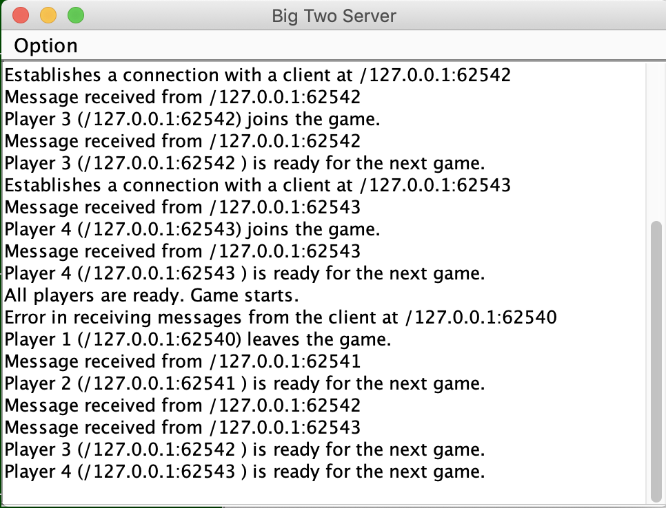
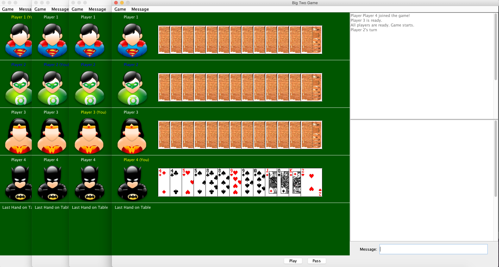

## Big-Two

A GUI enabled, multi-player, network facilitated Big Two Card Game in Java using Object Oriented Programming and multi-threading.

## Running the game

1. Compile all the .java files to bytecode (.class).
2. Start the Server (BigTwoServer.java).
3. Start 4 clients (BigTwoClient.java).
4. Play your cards according to the rules.

## Technology
1. Graphic User Interface using Java Swing Library
2. Object Oriented Programming Principles to model entities
3. Multi-threading to handle clients from a single server
4. Error handling 

## Server

## Clients

## Rules

Rules for this game can be found [here](https://en.wikipedia.org/wiki/Big_two)
